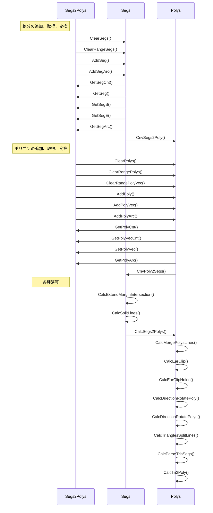

# dllのエクスポートされた関数の使い方

---

## 初めに

スタティックな内部バッファを2つ持っていて基本はバッファのインデックスを指定して任意の操作を行います。

内部バッファには2系統存在します。

- 線分バッファ

```cpp
  static std::vector<Line2> gSegs = std::vector<Line2>();
```
- ポリゴンバッファ

```cpp
  static std::vector<std::vector<Vec2>> gPolys = std::vector<std::vector<Vec2>>();
```

関数関係の説明では線分バッファは __"segs"__ ポリゴンバッファは __"polys"__ と省略しています。

---

## 関数とバッファーの相関図



---

## バッファクリア

<details><summary>Clear</summary>

```cpp
int Clear()
```
> segsとpolysをクリアします
>
> 返り値には必ず0が返ります
</details>

<details><summary>ClearSegs</summary>

```cpp
int ClearSegs()
```
> segsのみクリアします
>
> 返り値には必ず0が返ります
</details>

<details><summary>ClearPolys</summary>

```cpp
int ClearPolys()
```
> polysのみクリアします
>
> 返り値には必ず0が返ります
</details>

<details><summary>ClearRangeSegs</summary>

```cpp
int ClearRangeSegs(long s, long e)
```
> 指定範囲の線分バッファを削除します
>
> s, e：範囲
>
> エラーの場合-1を返します
</details>

<details><summary>ClearRangePolys</summary>

```cpp
int ClearRangePolys(long s, long e)
```
> 指定範囲のポリゴンバッファの図形を削除します
>
> s, e：範囲
>
> エラーの場合-1を返します
</details>

<details><summary>ClearRangePolyVec</summary>

```cpp
int ClearRangePolyVec(long pn, long s, long e)
```
> 指定範囲のポリゴンバッファの頂点を削除します
>
> pn：ポリゴンインデックス
>
> s, e：範囲
>
> エラーの場合-1を返します
</details>

---

## 線分の追加、取得、変換

<details><summary>AddSeg</summary>

```cpp
int AddSeg(double x1, double y1, long id1, double x2, double y2, long id2)
```
> 線分を追加します
>
> x1, y1, id1：始点
>
> x2, y2, id2：終点
>
> 返り値には必ず0が返ります
</details>

<details><summary>AddSegArc</summary>

```cpp
int AddSegArc(double x1, double y1, double x2, double y2, double cx, double cy, long id, double r)
```
> 円弧データを線分に分解して線分として追加します
>
> x1, y1：始点
>
> x2, y2：終点
>
> cx, cy：円弧の中点
>
> id：円弧から線分に変換した時に線分の各頂点につけられる
>
> r：分割する角度
>
> エラーの場合-1を返します
</details>

<details><summary>GetSegCnt</summary>

```cpp
long GetSegCnt()
```
> segsの総数を返します
</details>

<details><summary>GetSeg</summary>

```cpp
int GetSeg(long sn, double* x1, double* y1, long* id1, double* x2, double* y2, long* id2)
```
> 指定のsegsのインデックスのデータを取得
>
> sn：segsのインデックス
>
> x1, y1, id1：始点
>
> x2, y2, id2：終点
>
> エラーの場合-1を返します
</details>

<details><summary>GetSegS</summary>

```cpp
int GetSegS(long sn, double* x, double* y, long* id)
```
> 指定のsegsのインデックスの始点を取得
>
> sn：segsのインデックス
>
> x, y, id：始点
>
> エラーの場合-1を返します
</details>

<details><summary>GetSegE</summary>

```cpp
int GetSegE(long sn, double* x, double* y, long* id)
```
> 指定のsegsのインデックスの終点を取得
>
> sn：segsのインデックス
>
> x, y, id：終点
>
> エラーの場合-1を返します
</details>

<details><summary>GetSegArc</summary>

```cpp
int GetSegArc(long sn, double r, double rmargin, long minchain, long* en, double* x1, double* y1, double* x2, double* y2, double* cx, double* cy, long* id)
```
> 指定のsegsインデックスのデータが円弧かどうか、円弧だった場合は円弧データを返します
>
> sn：segsのインデックス
>
> r：分割時の角度
>
> rmargin：(+-)rの誤差
>
> minchain：対象の線分の最小連結数
>
> en：円弧の終点の次のインデックス
>
> x1, y1：始点
>
> x2, y2：終点
>
> cx, cy：円弧の中心
>
> id：線分の中心の始点id
>
> エラーの場合-1を返します
</details>

<details><summary>CnvSegs2Poly</summary>

```cpp
int CnvSegs2Poly()
```
> segsのデータをpolysの末尾に追加します
>
> この時末尾に追加されるのは始点のみです
>
> エラーの場合-1を返します
</details>

---

## ポリゴンの追加、取得、変換

<details><summary>AddPoly</summary>

```cpp
int AddPoly()
```
> polysのポリゴンを追加します
>
> エラーの場合-1を返します
</details>

<details><summary>AddPolyVec</summary>

```cpp
int AddPolyVec(long pn, double x, double y, long id)
```
> 指定のポリゴンに頂点を追加します
>
> pn：ポリゴンインデックス
>
> x, y, id：頂点データ
>
> エラーの場合-1を返します
</details>

<details><summary>AddPolyArc</summary>

```cpp
int AddPolyArc(long pn, double x1, double y1, double x2, double y2, double cx, double cy, long id, double r)
```
> 円弧データを頂点分解して追加します
>
> pn：ポリゴンインデックス
>
> x1, y1：始点
>
> x2, y2：終点
>
> cx, cy：円弧の中点
>
> id：円弧から頂点に変換した時に各頂点に付けられる
>
> r：分割する角度
>
> エラーの場合-1を返します
</details>

<details><summary>GetPolyCnt</summary>

```cpp
long GetPolyCnt()
```
> polysの総数を返します
</details>

<details><summary>GetPolyVecCnt</summary>

```cpp
long GetPolyVecCnt(long pn)
```
> 指定されたポリゴンインデックスの頂点数を返します
>
> pn：ポリゴンインデックス
>
> エラーの場合0を返します
</details>

<details><summary>GetPolyVec</summary>

```cpp
long GetPolyVec(long pn, long vn, double* x, double* y, long* id)
```
> 指定されたポリゴンインデックスの指定された頂点インデックスの頂点データを返します
>
> pn：ポリゴンインデックス
>
> vn：頂点インデックス
>
> x, y, id：頂点データ
>
> エラーの場合-1を返します
</details>

<details><summary>GetPolyArc</summary>

```cpp
int GetPolyArc(long pn, long vn, double r, double rmargin, long minchain, long* en, double* x1, double* y1, double* x2, double* y2, double* cx, double* cy, long* id)
```
> 指定されたポリゴンインデックスの指定された頂点インデックスの頂点データが円弧かどうか、円弧だった場合は円弧データを返します
>
> pn：ポリゴンインデックス
>
> vn：頂点インデックス
>
> r：分割時の角度
>
> rmargin：(+-)rの誤差
>
> minchain：対象の線分の最小連結数
>
> en：円弧の終点の次のインデックス
>
> x1, y1：始点
>
> x2, y2：終点
>
> cx, cy：円弧の中心
>
> id：線分の中心の始点id
>
> エラーの場合-1を返します
</details>

<details><summary>CnvPoly2Segs</summary>

```cpp
int CnvPoly2Segs(long pn)
```
> polysのデータをsegsの末尾に追加します
>
> エラーの場合-1を返します
</details>

---

## 各種演算

<details><summary>CalcExtendMarginIntersection</summary>

```cpp
int CalcExtendMarginIntersection(double dist)
```
> segsをマージンを持って交点計算を行います
>
> segsのデータを使用して処理後segsデータに返します
>
> エラーの場合-1を返します
</details>

<details><summary>CalcSplitLines</summary>

```cpp
int CalcSplitLines()
```
> segsの線分同士を交点で分解します
>
> segsのデータを使用して処理後segsデータに返します
>
> エラーの場合-1を返します
</details>

<details><summary>CalcSegs2Polys</summary>

```cpp
int CalcSegs2Polys()
```
> segsから最小のポリゴンを見つけpolysに追加します
>
> segsのデータを使用して処理後polysデータを生成します
>
> エラーの場合-1を返します
</details>

<details><summary>CalcMergePolysLines</summary>

```cpp
int CalcMergePolysLines()
```
> polysの頂点に交点などがなく頂点を削除しても問題ない頂点を削除します
>
> polysのデータを使用して処理後polysデータに返します
>
> エラーの場合-1を返します
</details>

<details><summary>CalcEarClip</summary>

```cpp
long CalcEarClip(long pn, long safety)
```
> 任意のpolysを三角形に変換してpolysの末尾に追加します
>
> pn：ポリゴンインデックス
>
> safety：無限ループ防止用
>
> polysに追加された図形数を返します
>
> エラーの場合-1を返します
</details>

<details><summary>CalcEarClipHoles</summary>

```cpp
long CalcEarClipHoles(long pn, long hpn, long* hp, long safety)
```
> 任意のpolysと任意の穴用polysを三角形に変換してpolysの末尾に追加します
>
> pn：ポリゴンインデックス
>
> hpn：穴の部分のポリゴンインデックスの数
>
> hp：穴の部分のポリゴンインデックス
>
> safety：無限ループ防止用
>
> polysに追加された図形数を返します
>
> エラーの場合-1を返します
</details>

<details><summary>CalcDirectionRotatePoly</summary>

```cpp
int CalcDirectionRotatePoly(long pn, int r)
```
> 指定のpolysを指定の回転方向に変更します
>
> pn：ポリゴンインデックス
>
> r：0=右回り 1=左回り
>
> エラーの場合-1を返します
</details>

<details><summary>CalcDirectionRotatePolys</summary>

```cpp
int CalcDirectionRotatePolys(int r)
```
> polysを指定の回転方向に変更します
>
> r：0=右回り 1=左回り
>
> エラーの場合-1を返します
</details>

<details><summary>CalcTrianglesSplitLines</summary>

```cpp
int CalcTrianglesSplitLines(long spn, long epn, long ssn, long esn)
```
> 三角形データを線分で分割してpolysの末尾に追加します
>
> spn, epn：polysの範囲
>
> ssn, esn：segsの範囲
>
> エラーの場合-1を返します
</details>

<details><summary>CalcAreaPoly</summary>

```cpp
double CalcAreaPoly(long pn)
```
> ポリゴンの面積を返します
>
> 絶対値が返ってくるわけではない
>
> pn：ポリゴンインデックス
>
> エラーの場合0を返します
</details>

<details><summary>CalcParseTrisSegs</summary>

```cpp
int CalcParseTrisSegs(long spn, long epn, long ssn, long esn)
```
> 三角形と線分から線分で区切られた範囲の図形をpolysの末尾に追加します
>
> spn, epn：polysの範囲
>
> ssn, esn：segsの範囲
>
> idにポリゴンのidxが入っている
>
> エラーの場合-1を返します
</details>

<details><summary>CalcTri2Poly</summary>

```cpp
int CalcTri2Poly(long spn, long epn)
```
> 三角形同士をマージしてポリゴンに変換してpolysの末尾に追加します
>
> spn, epn：polysの範囲
>
> エラーの場合-1を返します
</details>
