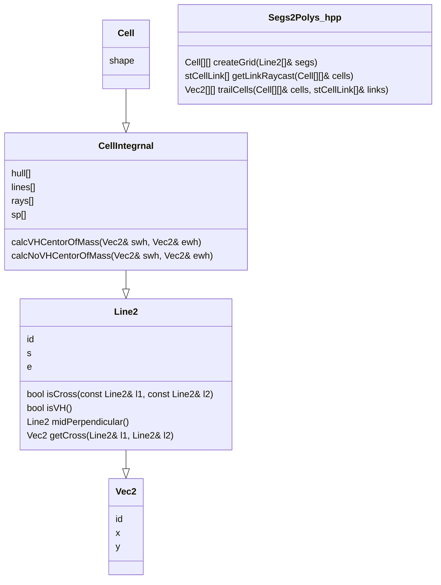

# 線分からポリゴンを見つけるための手順

1. 一つの線分に交差している線分をすべて取得して交点で分割する これをすべての線分で行う
2. 2d空間上を交点座標を使用してグリッド化
3. グリッド内にどの線分が含まれているかのデータを作成
4. グリッドを斜めの線などがまたがっている場合は斜めの線で分かたれた領域に1つ筒rayを配置する
   
     そうでない場合は重心にrayを配置する
5. 現在のセルと隣のセルのrayを結んで1で作成した線分と交差していなかった場合は現在のセルと隣のセルは同じポリゴンである

    そうでない場合は不定

---

## 内部参照グラフ

